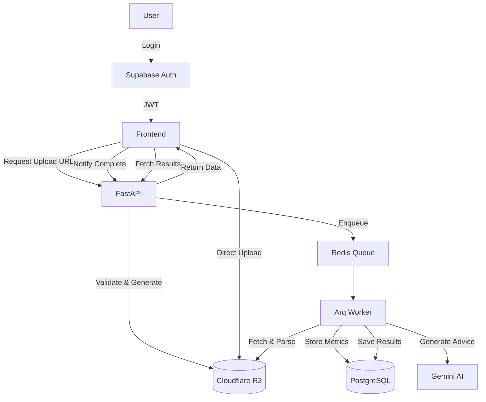

# Cloudflare R2 기반 FIT 파일 처리 아키텍처

## 아키텍처 다이어그램



## 구현 단계

### Phase 1: R2 기본 설정 (1-2일)

```python
# app/services/r2_service.py
import boto3
from typing import Optional, Dict
from datetime import timedelta

class R2Service:
    def __init__(self, account_id: str, access_key: str, secret_key: str, bucket: str):
        self.client = boto3.client(
            's3',
            endpoint_url=f'https://{account_id}.r2.cloudflarestorage.com',
            aws_access_key_id=access_key,
            aws_secret_access_key=secret_key
        )
        self.bucket = bucket

    def generate_upload_url(self, user_id: int, activity_id: int) -> Dict[str, str]:
        """Generate presigned PUT URL for direct upload."""
        key = f"users/{user_id}/activities/{activity_id}.fit"

        url = self.client.generate_presigned_url(
            'put_object',
            Params={'Bucket': self.bucket, 'Key': key},
            ExpiresIn=3600  # 1 hour
        )

        return {
            'upload_url': url,
            'key': key,
            'expires_in': 3600
        }

    def generate_download_url(self, key: str) -> str:
        """Generate presigned GET URL for worker."""
        return self.client.generate_presigned_url(
            'get_object',
            Params={'Bucket': self.bucket, 'Key': key},
            ExpiresIn=300  # 5 minutes
        )
```

### Phase 2: API 엔드포인트 (1일)

```python
# app/api/v1/endpoints/upload.py
from fastapi import APIRouter, Depends, HTTPException
from app.services.r2_service import R2Service
from app.models.activity import Activity

router = APIRouter()

@router.post("/activities/{activity_id}/upload-url")
async def get_upload_url(
    activity_id: int,
    current_user: User = Depends(get_current_user),
    db: AsyncSession = Depends(get_db),
    r2: R2Service = Depends(get_r2_service)
):
    """Generate presigned URL for FIT file upload."""

    # Verify ownership
    activity = await db.get(Activity, activity_id)
    if not activity or activity.user_id != current_user.id:
        raise HTTPException(403, "Not authorized")

    # Generate URL
    upload_info = r2.generate_upload_url(current_user.id, activity_id)

    # Save pending upload
    activity.fit_file_key = upload_info['key']
    activity.fit_file_status = 'pending'
    await db.commit()

    return upload_info

@router.post("/activities/{activity_id}/upload-complete")
async def confirm_upload(
    activity_id: int,
    file_size: int,
    checksum: str,
    current_user: User = Depends(get_current_user),
    db: AsyncSession = Depends(get_db)
):
    """Confirm upload completion and trigger analysis."""

    activity = await db.get(Activity, activity_id)
    if not activity or activity.user_id != current_user.id:
        raise HTTPException(403, "Not authorized")

    # Update status
    activity.fit_file_status = 'uploaded'
    activity.fit_file_size = file_size
    activity.fit_file_checksum = checksum
    await db.commit()

    # Enqueue analysis
    await enqueue_job('analyze_fit', activity_id=activity_id)

    return {"status": "analysis_started"}
```

### Phase 3: 비동기 워커 (2일)

```python
# app/workers/fit_analyzer.py
from arq import cron
from app.services.r2_service import R2Service
from app.services.fit_parser import parse_fit
from app.services.ai_service import generate_advice

async def analyze_fit(ctx: dict, activity_id: int):
    """Analyze FIT file from R2."""

    db = ctx['db']
    r2 = ctx['r2']

    # Get activity
    activity = await db.get(Activity, activity_id)
    if not activity or not activity.fit_file_key:
        return {'error': 'Activity not found'}

    try:
        # Download from R2
        download_url = r2.generate_download_url(activity.fit_file_key)
        async with httpx.AsyncClient() as client:
            response = await client.get(download_url)
            fit_data = response.content

        # Parse FIT
        metrics = parse_fit(fit_data)

        # Store metrics
        activity.avg_hr = metrics['avg_hr']
        activity.avg_pace_seconds = metrics['avg_pace']
        activity.elevation_gain = metrics['elevation_gain']
        # ... more metrics

        # Generate AI advice
        advice = await generate_advice(metrics)
        activity.ai_advice = advice

        # Update status
        activity.fit_file_status = 'analyzed'
        await db.commit()

        return {'status': 'success', 'activity_id': activity_id}

    except Exception as e:
        activity.fit_file_status = 'failed'
        activity.fit_error = str(e)
        await db.commit()
        raise

class WorkerSettings:
    functions = [analyze_fit]
    redis_settings = RedisSettings(host='localhost', port=6379)
```

### Phase 4: Frontend 업로드 (1일)

```typescript
// hooks/useDirectUpload.ts
export function useDirectUpload() {
  const uploadFit = async (activityId: number, file: File) => {
    // 1. Get presigned URL
    const { upload_url, key } = await api.post(
      `/activities/${activityId}/upload-url`
    );

    // 2. Direct upload to R2
    const response = await fetch(upload_url, {
      method: 'PUT',
      body: file,
      headers: {
        'Content-Type': 'application/octet-stream',
      },
    });

    if (!response.ok) throw new Error('Upload failed');

    // 3. Confirm upload
    const checksum = await calculateChecksum(file);
    await api.post(`/activities/${activityId}/upload-complete`, {
      file_size: file.size,
      checksum,
    });

    return { key, status: 'analyzing' };
  };

  return { uploadFit };
}
```

## 마이그레이션 계획

### 1단계: 새 테이블 추가
```sql
ALTER TABLE activities ADD COLUMN fit_file_key VARCHAR(255);
ALTER TABLE activities ADD COLUMN fit_file_status VARCHAR(20) DEFAULT 'pending';
ALTER TABLE activities ADD COLUMN fit_file_checksum VARCHAR(64);
```

### 2단계: 기존 파일 마이그레이션
```python
# scripts/migrate_to_r2.py
async def migrate_existing_files():
    """Migrate existing FIT files to R2."""

    activities = await db.query(Activity).filter(
        Activity.fit_file_path.isnot(None)
    ).all()

    for activity in activities:
        # Read from filesystem or DB
        if activity.fit_file_content:  # From DB
            fit_data = decompress(activity.fit_file_content)
        else:  # From filesystem
            fit_data = Path(activity.fit_file_path).read_bytes()

        # Upload to R2
        key = f"users/{activity.user_id}/activities/{activity.id}.fit"
        r2.upload_file(key, fit_data)

        # Update record
        activity.fit_file_key = key
        activity.fit_file_status = 'uploaded'

    await db.commit()
```

## 환경 변수

```bash
# .env
R2_ACCOUNT_ID=your_account_id
R2_ACCESS_KEY=your_access_key
R2_SECRET_KEY=your_secret_key
R2_BUCKET_NAME=fit-files
R2_PUBLIC_URL=https://fit-files.your-domain.com  # Optional CDN
```

## 비용 분석

### R2 요금 (2024년 기준)
- **저장**: $0.015/GB/월
- **Class A 작업** (PUT/POST): $4.50/백만 요청
- **Class B 작업** (GET): $0.36/백만 요청
- **전송료**: 무료!

### 예상 비용 (1,000명 활성 사용자)
- 저장: 50GB × $0.015 = $0.75/월
- 업로드: 30,000 요청 × $0.0045 = $0.14/월
- 다운로드: 100,000 요청 × $0.00036 = $0.04/월
- **총 비용**: ~$1/월

## 모니터링

```python
# 업로드 상태 대시보드
SELECT
    fit_file_status,
    COUNT(*) as count,
    AVG(fit_file_size) / 1024 as avg_kb
FROM activities
WHERE fit_file_key IS NOT NULL
GROUP BY fit_file_status;

# 분석 지연 시간
SELECT
    AVG(EXTRACT(EPOCH FROM (analyzed_at - uploaded_at))) as avg_delay_seconds
FROM activities
WHERE fit_file_status = 'analyzed'
AND uploaded_at > NOW() - INTERVAL '7 days';
```

## 장단점 요약

### 장점
✅ **확장성**: 사용자 10,000명+ 지원 가능
✅ **성능**: 서버 부하 90% 감소
✅ **비용**: 매우 저렴 (전송료 무료!)
✅ **안정성**: 99.9% 가용성 보장
✅ **CDN**: 전 세계 빠른 액세스

### 단점
❌ **복잡도**: 구현/운영 복잡도 증가
❌ **의존성**: Cloudflare 의존
❌ **백업**: 별도 백업 전략 필요
❌ **초기 구축**: 1주일 소요

## 결론

현재 규모(330개 파일, 46MB)에서는 **PostgreSQL이 충분**하지만,
다음 조건 중 하나라도 해당되면 **R2 전환 권장**:

- 월 활성 사용자 1,000명 이상
- 일일 업로드 100개 이상
- 총 저장 용량 10GB 이상
- 글로벌 서비스 계획
- 서버 리소스 제약

현재는 PostgreSQL로 운영하다가, 성장 시점에 R2로 전환하는 것이 실용적입니다.