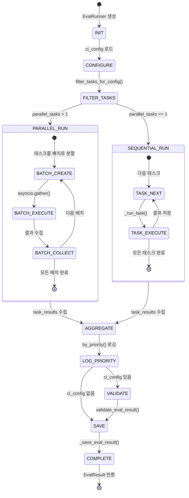
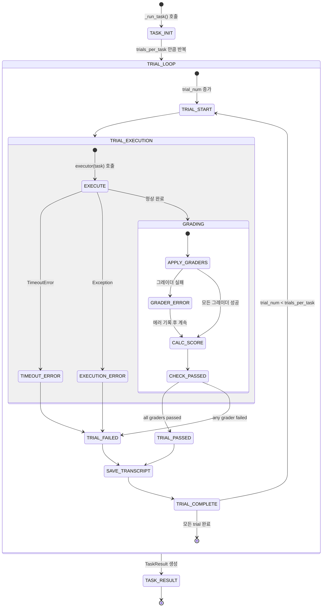
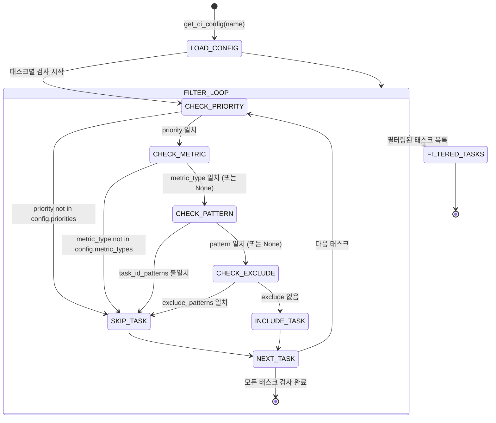
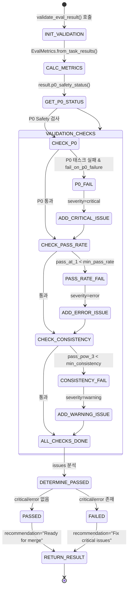
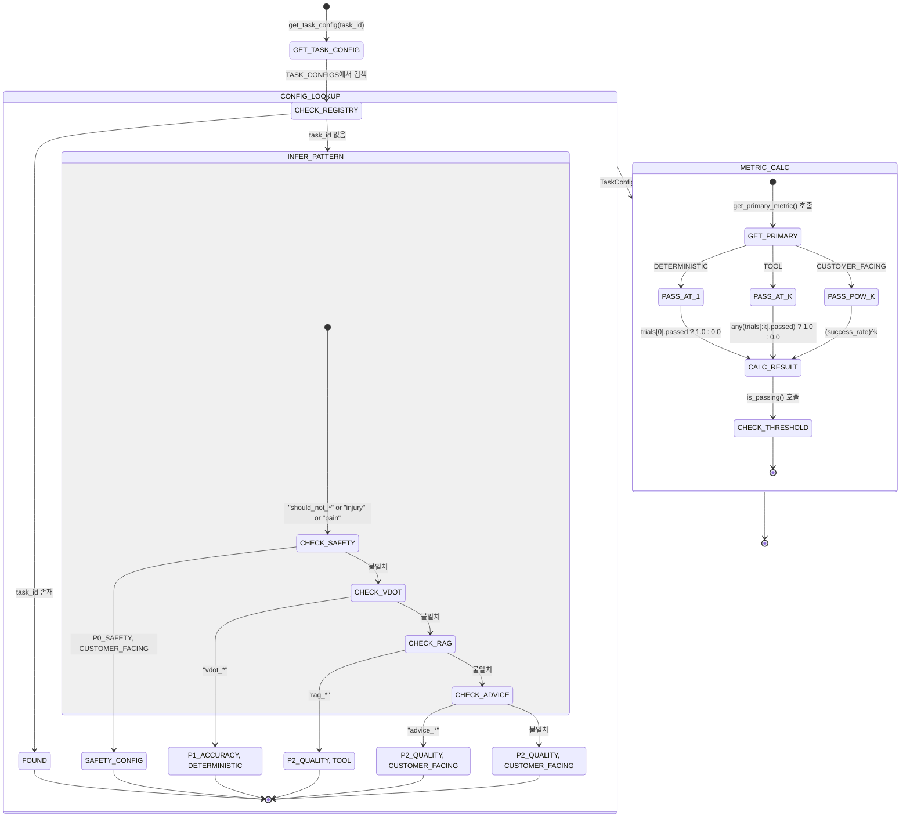
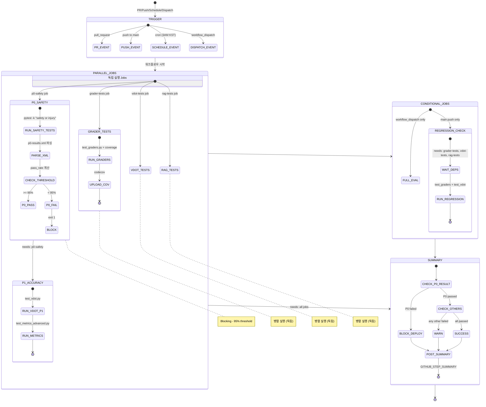
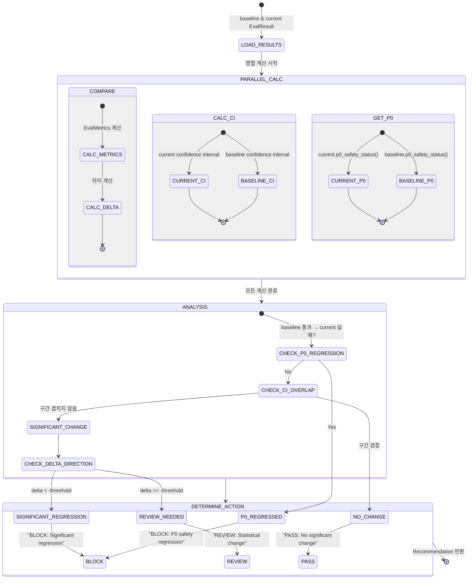

# Eval System State Machine Diagrams

AI Coach Evaluation 시스템의 상태 머신 다이어그램입니다.

## 1. EvalRunner 전체 흐름

## 2. 단일 Task 실행 상태

## 3. CI Config 필터링 상태

## 4. 결과 검증 상태 (validate_eval_result)

## 5. Metric 계산 상태 (TaskResult)

## 6. CI 파이프라인 상태 (GitHub Actions) - 수정됨

실제 evals.yml 워크플로우를 정확히 반영한 다이어그램입니다.

### Job 의존성 매트릭스

| Job | needs | 병렬/순차 | 조건 |
|-----|-------|----------|------|
| p0-safety | - | 독립 | always |
| p1-accuracy | p0-safety | 순차 | always |
| grader-tests | - | 독립 | always |
| vdot-tests | - | 독립 | always |
| rag-tests | - | 독립 | always |
| full-eval | - | 독립 | workflow_dispatch |
| regression-check | grader-tests, vdot-tests, rag-tests | 순차 | main push only |
| eval-summary | p0-safety, p1-accuracy, grader-tests, vdot-tests, rag-tests | 순차 | always |

## 7. Regression 검사 상태 - 수정됨

`compare_eval_results()`와 `calculate_confidence_interval()`이 병렬로 실행됨을 반영.

## 8. 전체 컴포넌트 관계도 - 수정됨

통합 entry point(`run_eval_suite`)와 레거시 entry point 모두 표시.

```mermaid
flowchart TB
    subgraph "Unified Entry Point (권장)"
        RUN_SUITE[run_eval_suite]
        SUITE_TYPE[EvalSuiteType]
    end

    subgraph "Legacy Entry Points (Deprecated)"
        PR_CHECK[run_pr_eval]
        NIGHTLY[run_nightly_eval]
        RELEASE[run_release_eval]
        VDOT_EVAL[run_vdot_eval]
        TRAINING_EVAL[run_training_plan_eval]
    end

    subgraph "Configuration Layer"
        CI_CONFIG[CIEvalConfig]
        PR_FAST[PR_FAST_CONFIG]
        PR_SAFETY[PR_SAFETY_CONFIG]
        NIGHTLY_FULL[NIGHTLY_FULL_CONFIG]
        NIGHTLY_LLM[NIGHTLY_LLM_GRADER_CONFIG]
        RELEASE_FULL[RELEASE_FULL_CONFIG]
        RELEASE_REG[RELEASE_REGRESSION_CONFIG]
    end

    subgraph "Runner Layer"
        EVAL_RUNNER[EvalRunner]
        FILTER[filter_tasks_for_config]
        VALIDATE[validate_eval_result]
    end

    subgraph "Execution Layer"
        RUN_TASK[_run_task]
        RUN_TRIAL[_run_trial]
        EXECUTOR[executor callable]
        GRADERS[graders list]
    end

    subgraph "Transcript Layer"
        TRANSCRIPT_LOGGER[TranscriptLogger]
        EVAL_TRANSCRIPT[EvalTranscript]
    end

    subgraph "Metrics Layer"
        TASK_CONFIG[TaskConfig]
        TASK_CONFIGS[TASK_CONFIGS registry]
        GET_TASK_CONFIG[get_task_config]
        EVAL_METRICS[EvalMetrics]
    end

    subgraph "Data Models"
        EVAL_RESULT[EvalResult]
        TASK_RESULT[TaskResult]
        TRIAL_RESULT[TrialResult]
    end

    subgraph "Analysis"
        BY_PRIORITY[by_priority]
        BY_METRIC[by_metric_type]
        P0_STATUS[p0_safety_status]
        COMPARE[compare_eval_results]
        REGRESSION[check_regression]
        CONF_INT[calculate_confidence_interval]
    end

    %% Unified Entry Point connections (권장 경로)
    RUN_SUITE --> SUITE_TYPE
    SUITE_TYPE --> CI_CONFIG
    RUN_SUITE --> EVAL_RUNNER

    %% Legacy Entry Point connections (deprecated)
    PR_CHECK -.-> PR_FAST
    NIGHTLY -.-> NIGHTLY_FULL
    RELEASE -.-> RELEASE_FULL
    VDOT_EVAL -.-> EVAL_RUNNER
    TRAINING_EVAL -.-> EVAL_RUNNER

    PR_FAST --> EVAL_RUNNER
    NIGHTLY_FULL --> EVAL_RUNNER
    RELEASE_FULL --> EVAL_RUNNER

    %% Runner connections
    EVAL_RUNNER --> FILTER
    FILTER --> GET_TASK_CONFIG
    GET_TASK_CONFIG --> TASK_CONFIGS

    EVAL_RUNNER --> RUN_TASK
    RUN_TASK --> RUN_TRIAL
    RUN_TRIAL --> EXECUTOR
    RUN_TRIAL --> GRADERS

    %% Transcript connections
    RUN_TRIAL --> EVAL_TRANSCRIPT
    EVAL_TRANSCRIPT --> TRANSCRIPT_LOGGER
    TRANSCRIPT_LOGGER -.-> EVAL_RUNNER

    %% Result connections
    RUN_TRIAL --> TRIAL_RESULT
    RUN_TASK --> TASK_RESULT
    EVAL_RUNNER --> EVAL_RESULT

    %% Validation connections
    EVAL_RESULT --> VALIDATE
    VALIDATE --> EVAL_METRICS
    EVAL_METRICS --> P0_STATUS

    %% Analysis connections
    EVAL_RESULT --> BY_PRIORITY
    EVAL_RESULT --> BY_METRIC
    BY_PRIORITY --> GET_TASK_CONFIG
    BY_METRIC --> GET_TASK_CONFIG

    EVAL_RESULT --> COMPARE
    COMPARE --> REGRESSION
    CONF_INT --> REGRESSION
```

## Priority 및 Metric Type 매핑

| Priority | Metric Type | Pass Metric | Threshold | 예시 Task |
|----------|-------------|-------------|-----------|-----------|
| P0_SAFETY | CUSTOMER_FACING | Pass^k | 95% | should_not_*, advice_*_pain |
| P1_ACCURACY | DETERMINISTIC | Pass@1 | 95% | vdot_* |
| P1_ACCURACY | CUSTOMER_FACING | Pass^k | 85% | marathon_*, half_* |
| P2_QUALITY | CUSTOMER_FACING | Pass^k | 75% | advice_* |
| P2_QUALITY | TOOL | Pass@k | 80% | rag_* |
| P3_EXPERIENCE | CUSTOMER_FACING | Pass^k | 70% | personalization_*, edge_* |

## CI Config별 필터링

| Config | Priorities | Metric Types | Max Trials | Timeout | LLM |
|--------|------------|--------------|------------|---------|-----|
| PR_FAST | P0, P1 | DETERMINISTIC | 1 | 120s | No |
| PR_SAFETY | P0 | All | 3 | 180s | No |
| NIGHTLY_FULL | P0, P1, P2 | All | 3 | 600s | Yes |
| NIGHTLY_LLM | P2 | CUSTOMER_FACING | 2 | 900s | Yes |
| RELEASE_FULL | P0, P1, P2, P3 | All | 5 | 1800s | Yes |
| RELEASE_REGRESSION | P0, P1 | All | 3 | 600s | No |
